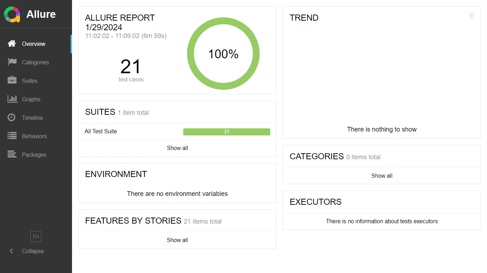
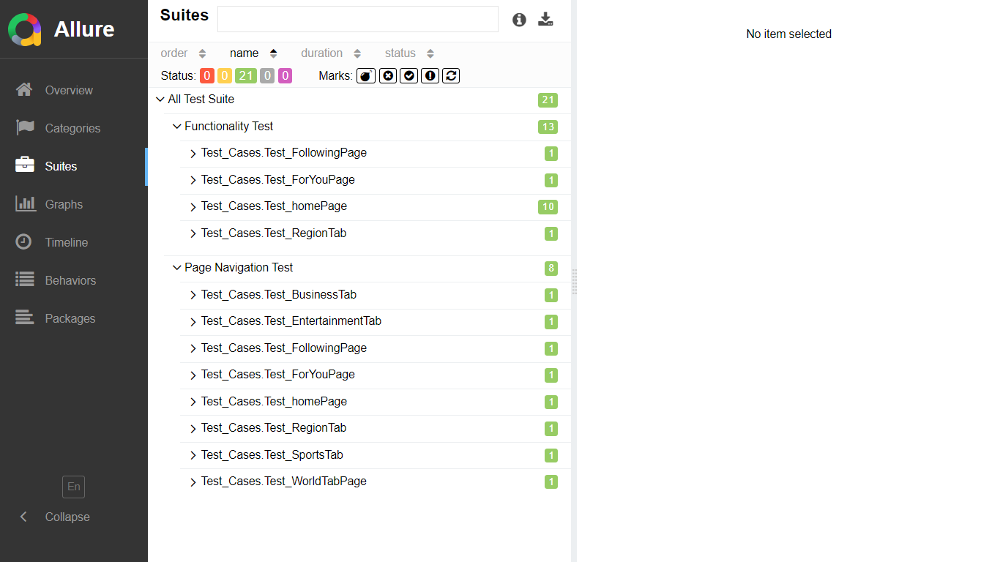

# Google-News_Mobile-Automation
##Overview
This automation test project is designed to validate the functionality of Google News through automated testing using the Selenium WebDriver framework with Java. The project aims to showcase best practices in automation testing, including test organization, configuration management, and test case design.

## Prerequisites
- Google News Apk Installed on Android device 
- [Android Studio](https://developer.android.com/studio/install) installed
- [Java](https://www.oracle.com/java/) installed
- [Maven](https://maven.apache.org/) installed
- [Appium](https://appium.io/docs/en/2.2/quickstart/install/) installed
- [Allure Report](https://allurereport.org/docs/gettingstarted-installation/) installed
- Preferred Browser(Chrome, FireFox or Edge)

## Setup

1. Clone this repository:

   ```bash
   git clone https://github.com/MahmudolHasan/Google-News_Mobile-Automation.git
   ```
2. Navigate to Project Folder </br>
```cd google-news-automation```
3. Install dependencies </br>
```mvn clean install```
### Configuration File 
 the configuration file can be found in `src/test/resources/config.properties`.Here, some parameters for the test are stored. One can change the parameter as needed. For example, if anyone prefers to start `appium server` from IDE, set `allure-run= true`.By default, it is false. Also, here, the emulator device name,udis can be changed as needed.
## Running the Project 

  1. Open the Java IDE
  2. Open the cloned folder of this repository from the IDE 
  3. Update the Maven project from the Editor
       * Use GUI to update Maven Project or,
       * Use command terminal
         ``` Bash
         mvn clean install -U
         ```
  4. Open the java file from  `/src/test/tests/`  </br>
  5. Select the Test Page  and open the Java file 
  5. Now to run the file:  </br>
   i. Can run the script as testNG suite or </br>
   ii. Run each test using the run option beside the `@Test`  annotation before each test case.(For Eclipse [TestNG for Eclipse](https://marketplace.eclipse.org/content/testng-eclipse) should be installed in Eclipse) [see this](https://www.guru99.com/install-testng-in-eclipse.html) for more information.</br>
  iii. Run from the project folder
        ``` Bash
         mvn test
        ```
## Reports 
Allure Report is used in this repository for report generation. To create an allure report after test execution, go to the terminal and navigate to the project folder. And run:
1. `allure serve`. This creates the same report Allure generates but puts it into a temporary directory and starts a local web server configured to show this directory's contents.
2. `allure generate.` This command processes the test results and saves an HTML report into the allure-report directory. To view the report, use the allure open command.
### The report of this project can be found under `src/allure-report/index.html`.
Some pictures of the allure results of this project: 
## License
This project is licensed under the MIT License.
<br>

  
   


